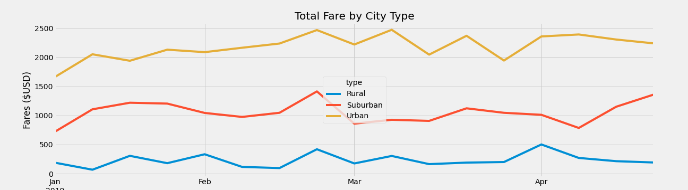
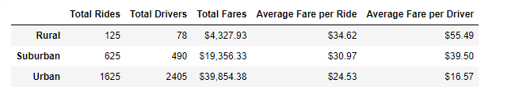

# Pyber Analysis

## Overview
The origonal purpose of the anaylsis was to graph ride sharing in under served communities by creating serveral data frames as well as graphs to display the trends in these communities. The later goal and object was to create a summary data frame onthe subject of ride sharing as well as generating a multi-line graph on total fares for each city type.

## Results
From our results, we see that while cities do have more fares as well as more riders, the more rural area pay more for their fares. Furthermore we can see from the data that there are less drivers and less riders in rural areas on the whole thus inflating the cost on the rider. Urban areas show the opposite trend, while there are more drivers and riders they are being charged less due to increased supply of drivers.

## Conclusion and Recommendation
The disapparites between rural and urban communities most likely lies at the personal need for a car within these two different enviroments. In a large city it is often a hinderance to own a car, due to high cost for parking along side with infrequent areas to park, coupled with consistant traffic alongside more direct public transportation which do not rely on roads such as subways make it more practical use other means of transportation. This means that when they do want a ride, they are more likely to use our service. On the other hand, in rural communities owning a car is more likely needed for simply getting around , as your nearest gorcery store could be 20 mintues away by car with no public transportation, so the average person is more likely to priotize owning a car.  

For Urban and Suburban communitites, Pyber should look into hiring people with largers vechiles such as multi-person vans such as those used by companes that shuttle people from the airport. What this would allow is for more people to take one vehicle and thus service more people as well as reduce thier individual fares along with allow the company to pây only one driver for the transport of several people, reducing costs. This could be also used to push for "greener riding" in marketing and help boost the companies image. For rural areas, were more people would simply rather drive themselves, it would be favourable to partner with local buisness such as food services. Another aveune would be to focus on those who may not wish to drive such as the elderly and work with old folks home to supply transportation for their residences to places such as malls.
